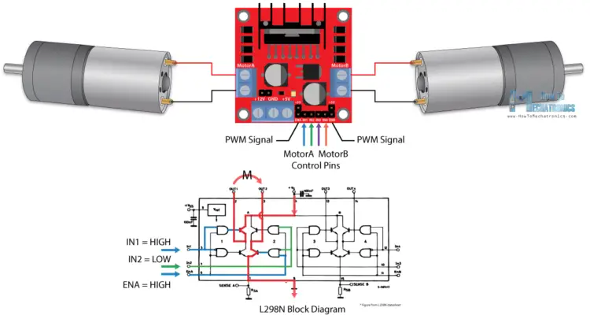

#Robot 1

##BOM
 2 x Motor
 1 x 5 V rectifier
 1 x 12 V rectifier
 1 x H Bridge L293D
 1 x RPI

 ###H Bridge detail

 
 
### RPI Pinout
Motor A Enable / PWB - PIN 12

Motor B Enable / PWB - PIN 13
Motor B PIN - PIN 5
Motor B PIN - PIN 6

